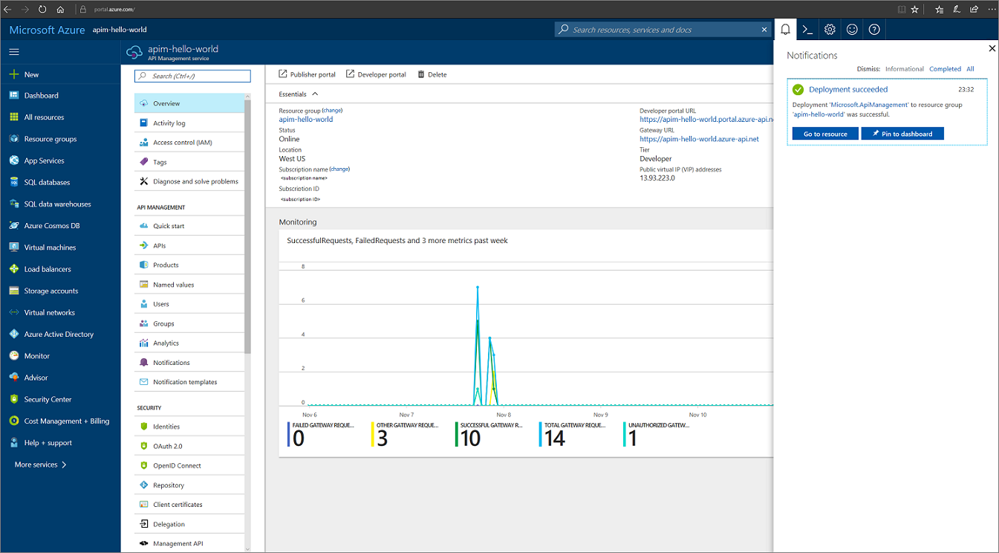
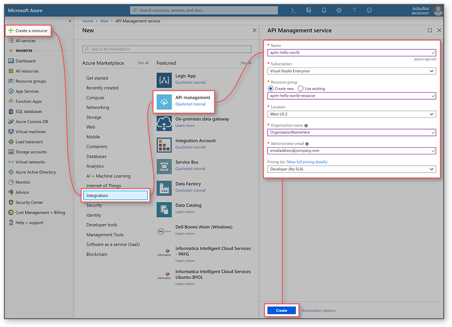
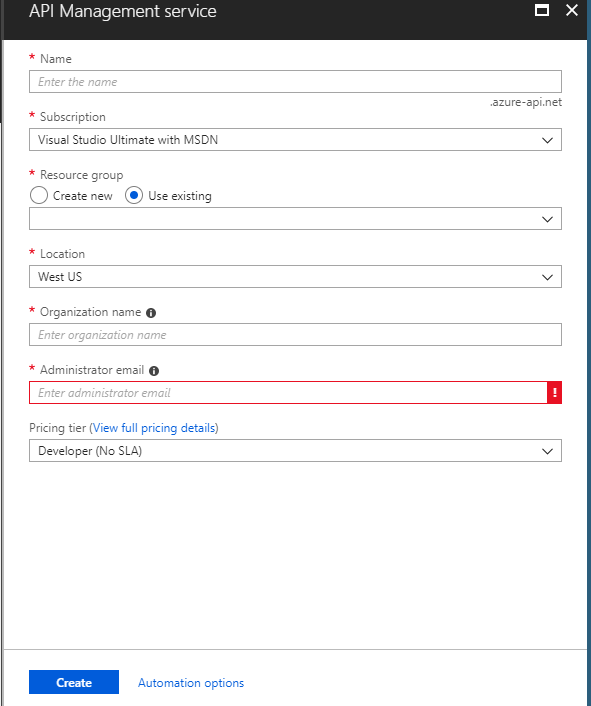
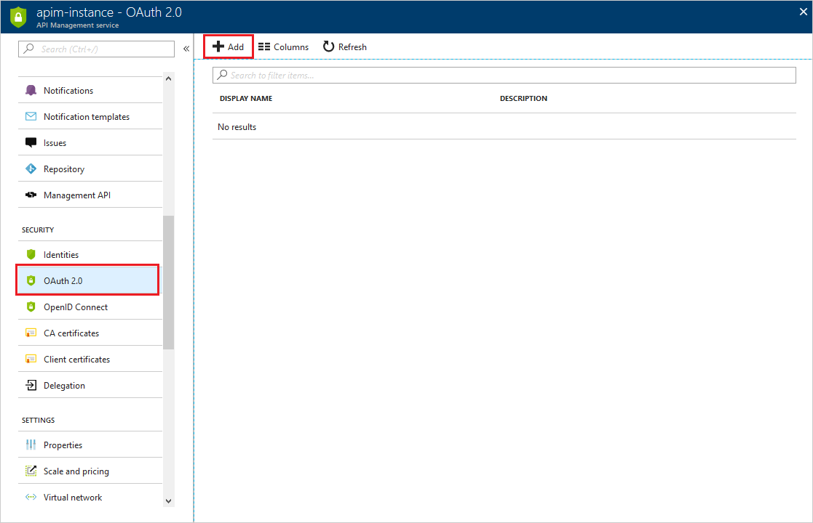
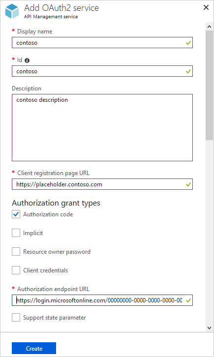
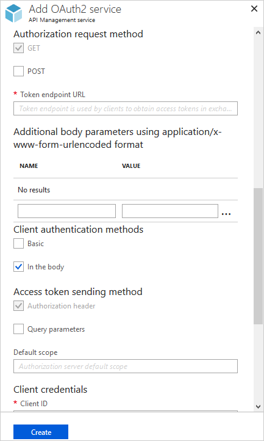
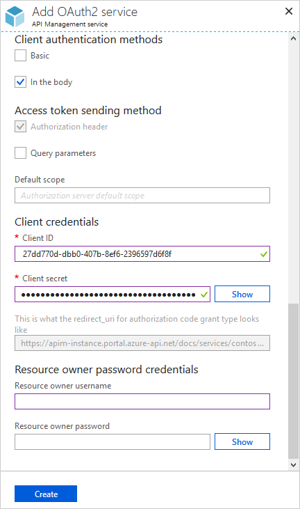
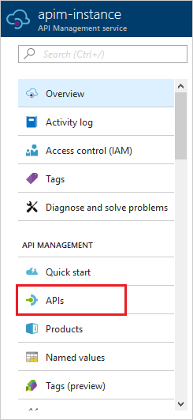
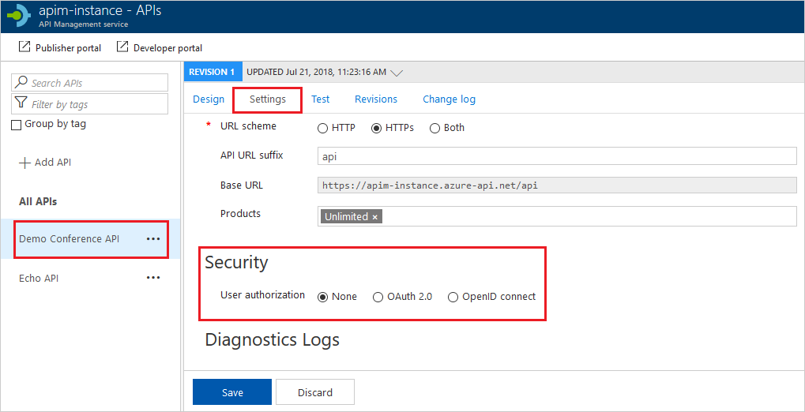
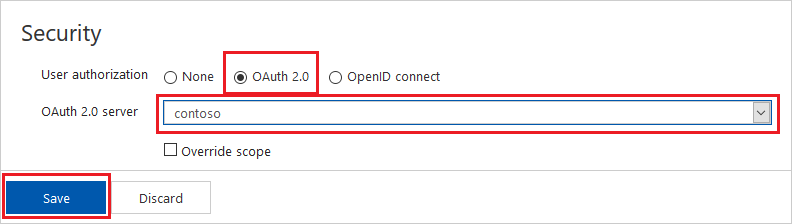

# Create a new Azure API Management service instance

Azure API Management (APIM) helps organizations publish APIs to external, partner, and internal developers to unlock the potential of their data and services. API Management provides the core competencies to ensure a successful API program through developer engagement, business insights, analytics, security, and protection. APIM  enables you to create and manage modern API gateways for existing backend services hosted anywhere.

This quickstart describes the steps for creating a new API Management instance using the Azure portal.

## Log in to Azure

Log in to the Azure portal at https://portal.azure.com.

The images are only ILLUSTRATIVE. Please set your own values.

## Create a new service

1. In the [Azure portal](https://portal.azure.com/), select **Create a resource** > **Enterprise Integration** > **API management**.

    Alternatively, choose **New**, type `API management` in the search box, and press Enter. Click **Create**.

2. In the **API Management service** window, enter settings.

    

| Setting                 | Suggested value                               | Description                                       
                                                                                                                   
**Name**                | A unique name for your API Management service | The name can't be changed later. Service name is used to generate a default domain name in the form of *{name}.azure-api.net.* Service name is used to refer to the service and the corresponding Azure resource. 

**Subscription**        | Your subscription                             | The subscription under which this new service instance will be created. You can select the subscription among the different Azure subscriptions that you have access to.                                                                                                                                                     
**Resource Group**      | *Your resource group*                           | You can select a new or existing resource. A resource group is a collection of resources that share lifecycle, permissions, and policies.                                                          
**Location**            | *your location*                                    | Select the geographic region near you. Only the available API Management service regions appear in the drop-down list box.                                                                                                                                                                                                          
**Organization name**   | The name of your organization                 | This name is used in a number of places, including the title of the developer portal and sender of notification emails.                                                                                                                                                                                                             
**Administrator email** | *admin\@org.com*                               | Set email address to which all the notifications from **API Management** will be sent.                                                                                                                                                                                                                                             
**Pricing tier**        | *Developer*                                   | Set **Developer** tier to evaluate the service. This tier is not for production use.                                                                                                                             |

3. Choose **Create**.

    > [!TIP]
    > It usually takes between 10 and 30 minutes to create an API Management service. Selecting **Pin to dashboard** makes finding a newly created service easier.

# Authorize API with Oauth 2.0 sample
## Global Prerequisities 
* [Download and install postman](https://www.getpostman.com/downloads/) if you don't already have
* Access to AAD tenant with owner rights - we need to create ClientAPP

Many APIs support [OAuth 2.0](https://oauth.net/2/) to secure the API and ensure that only valid users have access, and they can only access resources to which they're entitled. In order to use Azure API Management's interactive Developer Console with such APIs, the service allows you to configure your service instance to work with your OAuth 2.0 enabled API.

## Prerequisites

1. Created Client application in AAD (OAuth 2.0 server)
    * open portal
    * click on Azure Active Directory
    * click on App registrations
    * click on New registration
        * fill redirectUri with `https://localhost` (only for now)
        * check Access even ID tokens

This topic shows examples using Azure Active Directory as an OAuth 2.0 provider.

## Configure an OAuth 2.0 authorization server in API Management

1. Click on the OAuth 2.0 tab in the menu on the left and click on **+Add**.

    

2. Enter a name and an optional description in the **Name** and **Description** fields.

    > [!NOTE]
    > These fields are used to identify the OAuth 2.0 authorization server within the current API Management service instance and their values do not come from the OAuth 2.0 server.

3. Enter the **Client registration page URL**. This page is where users can create and manage their accounts, and varies depending on the OAuth 2.0 provider used. The **Client registration page URL** points to the page that users can use to create and configure their own accounts for OAuth 2.0 providers that support user management of accounts. Some organizations do not configure or use this functionality even if the OAuth 2.0 provider supports it. If your OAuth 2.0 provider does not have user management of accounts configured, enter a placeholder URL here such as the URL of your company, or a URL such as `http://localhost`.

    

4. The next section of the form contains the **Authorization grant types**, **Authorization endpoint URL**, and **Authorization request method** settings.

    Specify the **Authorization grant types** by checking the desired types. **Authorization code** is specified by default.

    Enter the **Authorization endpoint URL**. For Azure Active Directory, this URL will be similar to the following URL, where `<tenant_id>` is replaced with the ID of your Azure AD tenant.

    `https://login.microsoftonline.com/<tenant_id>/oauth2/authorize`

    The **Authorization request method** specifies how the authorization request is sent to the OAuth 2.0 server. By default **GET** is selected.

5. Then, **Token endpoint URL**, **Client authentication methods**, **Access token sending method** and **Default scope** need to be specified.

    

    For an Azure Active Directory OAuth 2.0 server, the **Token endpoint URL** will have the following format, where `<TenantID>`.

    `https://login.microsoftonline.com/<TenantID>/oauth2/token`

    The default setting for **Client authentication methods** is **Basic**, and  **Access token sending method** is **Authorization header**. These values are configured on this section of the form, along with the **Default scope**.

6. The **Client credentials** section contains the **Client ID** and **Client secret**, which are obtained during the creation and configuration process of your OAuth 2.0 server. Once the **Client ID** and **Client secret** are specified, the **redirect_uri** for the **authorization code** is generated. This URI is used to configure the reply URL in your OAuth 2.0 server configuration.

    

    If **Authorization grant types** is set to **Resource owner password**, the **Resource owner password credentials** section is used to specify those credentials; otherwise you can leave it blank.

    Once the form is complete, click **Create** to save the API Management OAuth 2.0 authorization server configuration. Once the server configuration is saved, you can configure APIs to use this configuration, as shown in the next section.

## Configure an API to use OAuth 2.0 user authorization

1. Click **APIs** from the **API Management** menu on the left.

    

2. Click the name of the desired API and click **Settings**. Scroll to the **Security** section, and then check the box for **OAuth 2.0**.

    

3. Select the desired **Authorization server** from the drop-down list, and click **Save**.

    

## IMPORTANT
    * go back to your oauth2 configuration and catch the URL under the client secret section
    * it might like like https://apim-tslavik.portal.azure-api.net/docs/services/azureacademy/console/oauth2/authorizationcode/callback
    * go to App registration you already created and paste that URL to RedirectURI
    * click save

## Test the OAuth 2.0 user authorization in the Developer Portal

Once you have configured your OAuth 2.0 authorization server and configured your API to use that server, you can test it by going to the Developer Portal and calling an API.  Click **Developer portal** in the top menu from your Azure API Management instance **Overview** page.

Click **APIs** in the top menu and select **Echo API**.

Select the **GET Resource** operation, click **Open Console**, and then select **Authorization code** from the drop-down.

When **Authorization code** is selected, a pop-up window is displayed with the sign-in form of the OAuth 2.0 provider. In this example the sign-in form is provided by Azure Active Directory.

Once you have signed in, the **Request headers** are populated with an `Authorization : Bearer` header that authorizes the request.

At this point you can configure the desired values for the remaining parameters, and submit the request.

If you get 200 as a response, your API is secured correctly by Oauth2.

# Your action (60 min) - group of 4-6 members
## Use Azure API Management docs
## Use Azure function for the backend
  * write your own API that:
      * has to be secured by AAD token - use Oauth2 and authorization endpoint v1.0
      * validate JWT on audience claim
      * extract name from token and set to backend in HTTP header name `username`
      * restrict call only for your IP address 
      * set additional header name `errorRequestId` with unique RequestId value to response when error occurs - you can test it within IP restrictions
      * set rate limit to max 3 calls every 30 seconds for every ip and only for succesfull requests
