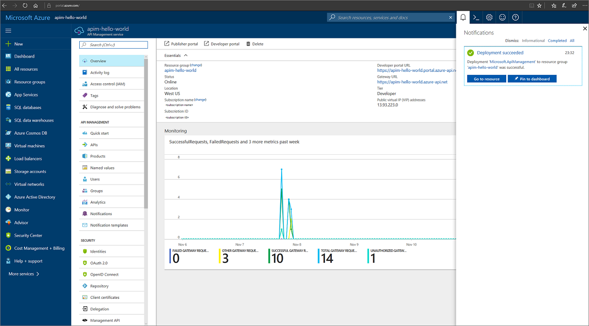
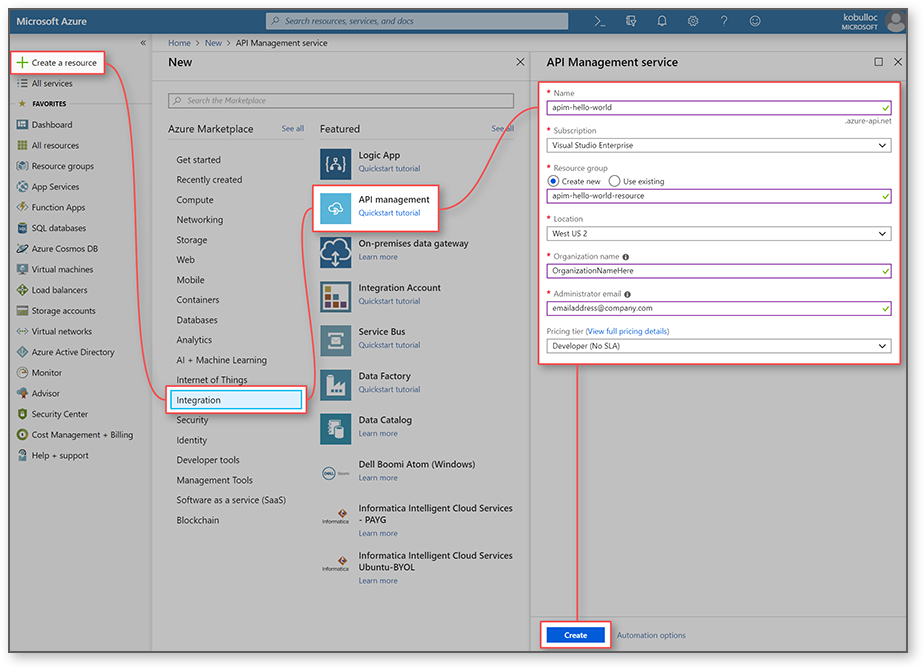
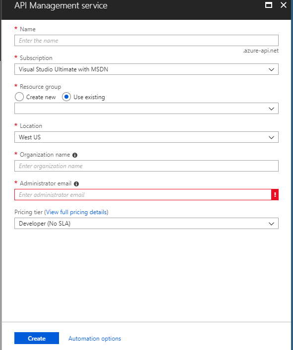
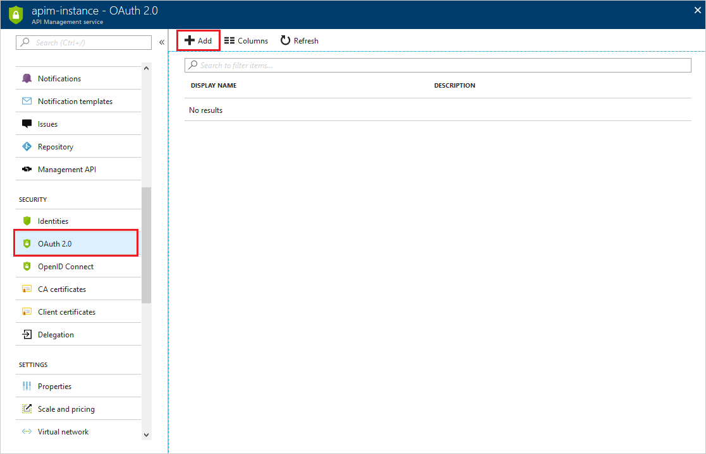
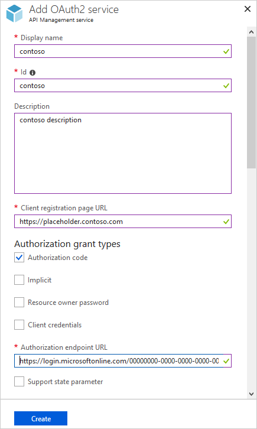
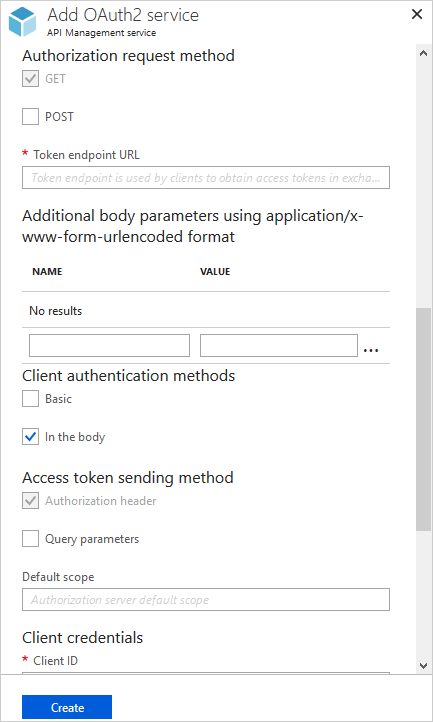
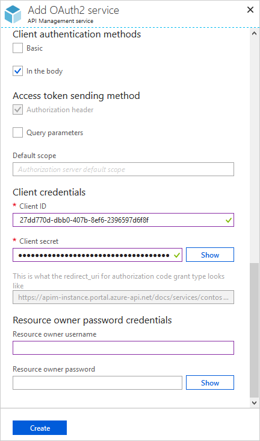
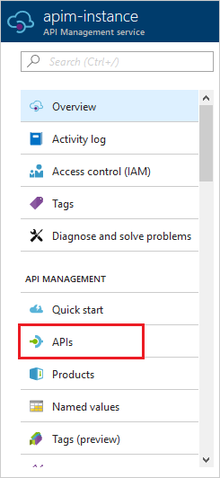
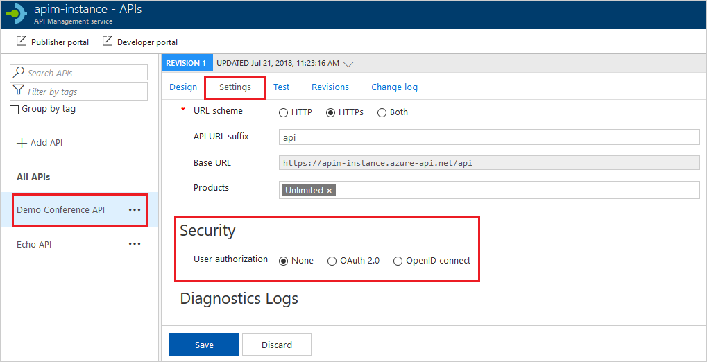

# Create a new Azure API Management service instance

Azure API Management (APIM) helps organizations publish APIs to external, partner, and internal developers to unlock the potential of their data and services. API Management provides the core competencies to ensure a successful API program through developer engagement, business insights, analytics, security, and protection. APIM  enables you to create and manage modern API gateways for existing backend services hosted anywhere.

This quickstart describes the steps for creating a new API Management instance using the Azure portal.




## Log in to Azure

Log in to the Azure portal at https://portal.azure.com.

## Create a new service



1. In the [Azure portal](https://portal.azure.com/), select **Create a resource** > **Enterprise Integration** > **API management**.

    Alternatively, choose **New**, type `API management` in the search box, and press Enter. Click **Create**.

2. In the **API Management service** window, enter settings.

    

| Setting                 | Suggested value                               | Description                                       
                                                                                                                   
**Name**                | A unique name for your API Management service | The name can't be changed later. Service name is used to generate a default domain name in the form of *{name}.azure-api.net.* Service name is used to refer to the service and the corresponding Azure resource. 

**Subscription**        | Your subscription                             | The subscription under which this new service instance will be created. You can select the subscription among the different Azure subscriptions that you have access to.                                                                                                                                                     
**Resource Group**      | *Your resource group*                           | You can select a new or existing resource. A resource group is a collection of resources that share lifecycle, permissions, and policies.                                                          
**Location**            | *your location*                                    | Select the geographic region near you. Only the available API Management service regions appear in the drop-down list box.                                                                                                                                                                                                          
**Organization name**   | The name of your organization                 | This name is used in a number of places, including the title of the developer portal and sender of notification emails.                                                                                                                                                                                                             
**Administrator email** | *admin\@org.com*                               | Set email address to which all the notifications from **API Management** will be sent.                                                                                                                                                                                                                                             
**Pricing tier**        | *Developer*                                   | Set **Developer** tier to evaluate the service. This tier is not for production use.                                                                                                                             |

3. Choose **Create**.

    > [!TIP]
    > It usually takes between 10 and 30 minutes to create an API Management service. Selecting **Pin to dashboard** makes finding a newly created service easier.


# About API Management

API Management (APIM) is a way to create consistent and modern API gateways for existing back-end services.

API Management helps organizations publish APIs to external, partner, and internal developers to unlock the potential of their data and services. Businesses everywhere are looking to extend their operations as a digital platform, creating new channels, finding new customers and driving deeper engagement with existing ones. API Management provides the core competencies to ensure a successful API program through developer engagement, business insights, analytics, security, and protection. You can use Azure API Management to take any backend and launch a full-fledged API program based on it.

This article provides an overview of common scenarios that involve APIM.  It also gives a brief overview of the APIM system's main components. The article, then, gives a more detailed overview of each component.

## Overview

To use API Management, administrators create APIs. Each API consists of one or more operations, and each API can be added to one or more products. To use an API, developers subscribe to a product that contains that API, and then they can call the API's operation, subject to any usage policies that may be in effect. Common scenarios include:

* **Securing mobile infrastructure** by gating access with API keys, preventing DOS attacks by using throttling, or using advanced security policies like JWT token validation.
* **Enabling ISV partner ecosystems** by offering fast partner onboarding through the developer portal and building an API facade to decouple from internal implementations that are not ripe for partner consumption.
* **Running an internal API program** by offering a centralized location for the organization to communicate about the availability and latest changes to APIs, gating access based on organizational accounts, all based on a secured channel between the API gateway and the backend.

The system is made up of the following components:

* The **API gateway** is the endpoint that:
  
  * Accepts API calls and routes them to your backends.
  * Verifies API keys, JWT tokens, certificates, and other credentials.
  * Enforces usage quotas and rate limits.
  * Transforms your API on the fly without code modifications.
  * Caches backend responses where set up.
  * Logs call metadata for analytics purposes.
* The **Azure portal** is the administrative interface where you set up your API program. Use it to:
  
  * Define or import API schema.
  * Package APIs into products.
  * Set up policies like quotas or transformations on the APIs.
  * Get insights from analytics.
  * Manage users.
* The **Developer portal** serves as the main web presence for developers, where they can:
  
  * Read API documentation.
  * Try out an API via the interactive console.
  * Create an account and subscribe to get API keys.
  * Access analytics on their own usage.

For more information, see the [Cloud-based API Management: Harnessing the Power of APIs](https://j.mp/ms-apim-whitepaper) PDF whitepaper. This introductory whitepaper on API Management by CITO Research covers: 
 
 * Common API requirements and challenges
 * Decoupling APIs and presenting facades
 * Getting developers up and running quickly
 * Securing access
 * Analytics and metrics
 * Gaining control and insight with an API Management platform
 * Using cloud vs on-premises solutions
 * Azure API Management
 
## <a name="apis"> </a>APIs and operations
APIs are the foundation of an API Management service instance. Each API represents  a set of operations available to developers. Each API contains a reference to the back-end service that implements the API, and its operations map to the operations implemented by the back-end service. Operations in API Management are highly configurable, with control over URL mapping, query and path parameters, request and response content, and operation response caching. Rate limit, quotas, and IP restriction policies can also be implemented at the API or individual operation level.


## <a name="products"> </a> Products
Products are how APIs are surfaced to developers. Products in API Management have one or more APIs, and are configured with a title, description, and terms of use. Products can be **Open** or **Protected**. Protected products must be subscribed to before they can be used, while open products can be used without a subscription. When a product is ready for use by developers, it can be published. Once it is published, it can be viewed (and in the case of protected products subscribed to) by developers. Subscription approval is configured at the product level and can either require administrator approval, or be auto-approved.

Groups are used to manage the visibility of products to developers. Products grant visibility to groups, and developers can view and subscribe to the products that are visible to the groups in which they belong. 

## <a name="groups"> </a> Groups
Groups are used to manage the visibility of products to developers. API Management has the following immutable system groups:

* **Administrators** - Azure subscription administrators are members of this group. Administrators manage API Management service instances, creating the APIs, operations, and products that are used by developers.
* **Developers** - Authenticated developer portal users fall into this group. Developers are the customers that build applications using your APIs. Developers are granted access to the developer portal and build applications that call the operations of an API.
* **Guests** - Unauthenticated developer portal users, such as prospective customers visiting the developer portal of an API Management instance fall into this group. They can be granted certain read-only access, such as the ability to view APIs but not call them.

In addition to these system groups, administrators can create custom groups or leverage external groups in associated Azure Active Directory tenants. Custom and external groups can be used alongside system groups in giving developers visibility and access to API products. For example, you could create one custom group for developers affiliated with a specific partner organization and allow them access to the APIs from a product containing relevant APIs only. A user can be a member of more than one group.

<!-- For more information, see  [How to create and use groups][How to create and use groups]. -->

## <a name="developers"> </a> Developers
Developers represent the user accounts in an API Management service instance. Developers can be created or invited to join by administrators, or they can sign up from the Developer portal. Each developer is a member of one or more groups, and can subscribe to the products that grant visibility to those groups.

When developers subscribe to a product, they are granted the primary and secondary key for the product. This key is used when making calls into the product's APIs.


# Policies in Azure API Management

In Azure API Management (APIM), policies are a powerful capability of the system that allow the publisher to change the behavior of the API through configuration. Policies are a collection of Statements that are executed sequentially on the request or response of an API. Popular Statements include format conversion from XML to JSON and call rate limiting to restrict the amount of incoming calls from a developer. Many more policies are available out of the box.

Policies are applied inside the gateway which sits between the API consumer and the managed API. The gateway receives all requests and usually forwards them unaltered to the underlying API. However a policy can apply changes to both the inbound request and outbound response.

Policy expressions can be used as attribute values or text values in any of the API Management policies, unless the policy specifies otherwise. Some policies such as the [Control flow](https://msdn.microsoft.com/library/azure/dn894085.aspx#choose) and [Set variable](https://msdn.microsoft.com/library/azure/dn894085.aspx#set_variable) policies are based on policy expressions. For more information, see [Advanced policies](https://msdn.microsoft.com/library/azure/dn894085.aspx) and [Policy expressions](https://msdn.microsoft.com/library/azure/dn910913.aspx).

## <a name="sections"> </a>Understanding policy configuration

The policy definition is a simple XML document that describes a sequence of inbound and outbound statements. The XML can be edited directly in the definition window. A list of statements is provided to the right and statements applicable to the current scope are enabled and highlighted.

Clicking an enabled statement will add the appropriate XML at the location of the cursor in the definition view. 


The configuration is divided into `inbound`, `backend`, `outbound`, and `on-error`. The series of specified policy statements is executes in order for a request and a response.

```xml
<policies>
  <inbound>
    <!-- statements to be applied to the request go here -->
  </inbound>
  <backend>
    <!-- statements to be applied before the request is forwarded to 
         the backend service go here -->
  </backend>
  <outbound>
    <!-- statements to be applied to the response go here -->
  </outbound>
  <on-error>
    <!-- statements to be applied if there is an error condition go here -->
  </on-error>
</policies> 
```

## <a name="developer-portal"> </a> Developer portal
The developer portal is where developers can learn about your APIs, view and call operations, and subscribe to products. Prospective customers can visit the developer portal, view APIs and operations, and sign up. The URL for your developer portal is located on the dashboard in the Azure portal for your API Management service instance.

You can customize the look and feel of your developer portal by adding custom content, customizing styles, and adding your branding.


# Samples
## Global Prerequisities 
* [Download and install postman](https://www.getpostman.com/downloads/) if you don't already have
* Access to AAD tenant with owner rights - we need to create ClientAPP

1. Authorize API with oauth 2.0

Many APIs support [OAuth 2.0](https://oauth.net/2/) to secure the API and ensure that only valid users have access, and they can only access resources to which they're entitled. In order to use Azure API Management's interactive Developer Console with such APIs, the service allows you to configure your service instance to work with your OAuth 2.0 enabled API.

## <a name="prerequisites"> </a>Prerequisites

1. Created Client application in AAD (OAuth 2.0 server)
    * open portal
    * click on Azure Active Directory
    * click on App registrations
    * click on New registration
        * fill redirectUri with `https://localhost` (only for now)
        * check Access even ID tokens

This topic shows examples using Azure Active Directory as an OAuth 2.0 provider.

## <a name="step1"> </a>Configure an OAuth 2.0 authorization server in API Management

1. Click on the OAuth 2.0 tab in the menu on the left and click on **+Add**.

    

2. Enter a name and an optional description in the **Name** and **Description** fields.

    > [!NOTE]
    > These fields are used to identify the OAuth 2.0 authorization server within the current API Management service instance and their values do not come from the OAuth 2.0 server.

3. Enter the **Client registration page URL**. This page is where users can create and manage their accounts, and varies depending on the OAuth 2.0 provider used. The **Client registration page URL** points to the page that users can use to create and configure their own accounts for OAuth 2.0 providers that support user management of accounts. Some organizations do not configure or use this functionality even if the OAuth 2.0 provider supports it. If your OAuth 2.0 provider does not have user management of accounts configured, enter a placeholder URL here such as the URL of your company, or a URL such as `http://localhost`.

    

4. The next section of the form contains the **Authorization grant types**, **Authorization endpoint URL**, and **Authorization request method** settings.

    Specify the **Authorization grant types** by checking the desired types. **Authorization code** is specified by default.

    Enter the **Authorization endpoint URL**. For Azure Active Directory, this URL will be similar to the following URL, where `<tenant_id>` is replaced with the ID of your Azure AD tenant.

    `https://login.microsoftonline.com/<tenant_id>/oauth2/authorize`

    The **Authorization request method** specifies how the authorization request is sent to the OAuth 2.0 server. By default **GET** is selected.

5. Then, **Token endpoint URL**, **Client authentication methods**, **Access token sending method** and **Default scope** need to be specified.

    

    For an Azure Active Directory OAuth 2.0 server, the **Token endpoint URL** will have the following format, where `<TenantID>`  has the format of `yourapp.onmicrosoft.com`.

    `https://login.microsoftonline.com/<TenantID>/oauth2/token`

    The default setting for **Client authentication methods** is **Basic**, and  **Access token sending method** is **Authorization header**. These values are configured on this section of the form, along with the **Default scope**.

6. The **Client credentials** section contains the **Client ID** and **Client secret**, which are obtained during the creation and configuration process of your OAuth 2.0 server. Once the **Client ID** and **Client secret** are specified, the **redirect_uri** for the **authorization code** is generated. This URI is used to configure the reply URL in your OAuth 2.0 server configuration.

    

    If **Authorization grant types** is set to **Resource owner password**, the **Resource owner password credentials** section is used to specify those credentials; otherwise you can leave it blank.

    Once the form is complete, click **Create** to save the API Management OAuth 2.0 authorization server configuration. Once the server configuration is saved, you can configure APIs to use this configuration, as shown in the next section.

## <a name="step2"> </a>Configure an API to use OAuth 2.0 user authorization

1. Click **APIs** from the **API Management** menu on the left.

    

2. Click the name of the desired API and click **Settings**. Scroll to the **Security** section, and then check the box for **OAuth 2.0**.

    

3. Select the desired **Authorization server** from the drop-down list, and click **Save**.

    

## IMPORTANT
    * go back to your oauth2 configuration and catch the URL under the client secret section
    * it might like like https://apim-tslavik.portal.azure-api.net/docs/services/azureacademy/console/oauth2/authorizationcode/callback
    * go to App registration you already created and paste that URL to RedirectURI
    * click save


## <a name="step3"> </a>Test the OAuth 2.0 user authorization in the Developer Portal

Once you have configured your OAuth 2.0 authorization server and configured your API to use that server, you can test it by going to the Developer Portal and calling an API.  Click **Developer portal** in the top menu from your Azure API Management instance **Overview** page.


Click **APIs** in the top menu and select **Echo API**.

Select the **GET Resource** operation, click **Open Console**, and then select **Authorization code** from the drop-down.


When **Authorization code** is selected, a pop-up window is displayed with the sign-in form of the OAuth 2.0 provider. In this example the sign-in form is provided by Azure Active Directory.


Once you have signed in, the **Request headers** are populated with an `Authorization : Bearer` header that authorizes the request.


At this point you can configure the desired values for the remaining parameters, and submit the request.

If you get 200 as a response, your API is secured correctly by Oauth2.

# Your action (60 min)
## Use Azure docs
  * write your own API that:
      * has to be secured by AAD token - use Oauth2 and authorization endpoint v1.0
      * validate JWT on audience claim
      * extract name from token and set to backend in HTTP header name `username`
      * restrict call only for your IP address 
      * set additional header name `errorRequestId` with unique RequestId value to response when error occurs - you can test it within IP restrictions
      * set rate limit to max 3 calls every 30 seconds for every ip and only for succesfull requests
