# Durable Functions patterns and technical concepts

Durable Functions is an extension of Azure Functions. You can use Durable Functions for stateful orchestration of function execution. A durable function is a solution that's made up of different Azure functions. Functions can play different roles in a durable function orchestration.

## Benefits

The extension lets you define stateful workflows using an [*orchestrator function*](durable-functions-types-features-overview.md#orchestrator-functions), which can provide the following benefits:

* You can define your workflows in code. No JSON schemas or designers are needed.
* Other functions can be called both synchronously and asynchronously. Output from called functions can be saved to local variables.
* Progress is automatically checkpointed when the function awaits. Local state is never lost when the process recycles or the VM reboots.
 

This article gives you an overview of the types of functions you can use in a Durable Functions orchestration. The article includes some common patterns you can use to connect functions. Learn how Durable Functions can help you solve your app development challenges.

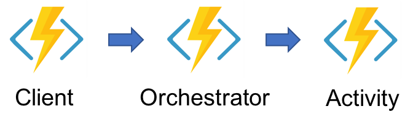

## Types of durable functions

You can use four durable function types in Azure Functions: activity, orchestrator and client.

### **Activity functions**

Activity functions are the basic unit of work in a durable function orchestration. Activity functions are the functions and tasks that are orchestrated in the process. For example, you might create a durable function to process an order. The tasks involve checking the inventory, charging the customer, and creating a shipment. Each task would be an activity function. 

Activity functions aren't restricted in the type of work you can do in them. You can write an activity function in any language that Durable Functions support. The durable task framework guarantees that each called activity function will be executed at least once during an orchestration.

Use an *activity trigger* to trigger an activity function.

Your activity function can also return values to the orchestrator. If you send or return a large number of values from an activity function, you can use arrays. You can trigger an activity function only from an orchestration instance. Although an activity function and another function (like an HTTP-triggered function) might share some code, each function can have only one trigger.

### **Orchestrator functions**

Orchestrator functions describe how actions are executed and the order in which actions are executed. Orchestrator functions describe the orchestration in code (C# or JavaScript). An orchestration can have many different types of actions, including activity functions, sub-orchestrations, waiting for external events, and timers. 

An orchestrator function must be triggered by an orchestration trigger.

An orchestrator is started by an orchestrator client. You can trigger the orchestrator from any source (HTTP, queue, event stream). Each instance of an orchestration has an instance identifier. The instance identifier can be autogenerated (recommended) or user-generated. You can use the instance identifier to manage instances of the orchestration.

### **Client functions**

Client functions are triggered functions that create and manage instances of orchestrations and entities. They are effectively the entry point for interacting with Durable Functions. You can trigger a client function from any source (HTTP, queue, event stream, etc.). A client function uses the orchestration client binding to create and manage durable orchestrations and entities.

## Application patterns

The primary use case for Durable Functions is simplifying complex, stateful coordination requirements in serverless applications. The following are some typical application patterns that can benefit from Durable Functions:

* Chaining
* Fan-out/fan-in
* Async HTTP APIs
* Monitoring
* Human interaction

## <a name="language-support"></a>Supported languages

Durable Functions currently supports the following languages:

* **C#**: both precompiled class libraries and C# script.
* **F#**: precompiled class libraries and F# script. F# script is only supported for version 1.x of the Azure Functions runtime.
* **JavaScript**: supported only for version 2.x of the Azure Functions runtime. Requires version 1.7.0 of the Durable Functions extension, or a later version. 

## Billing

Durable Functions are billed the same as Azure Functions. For more information, see [Azure Functions pricing](https://azure.microsoft.com/pricing/details/functions/).

# Patterns

This section describes some common application patterns where Durable Functions can be useful.

### <a name="chaining"></a>Pattern #1: Function chaining

In the function chaining pattern, a sequence of functions executes in a specific order. In this pattern, the output of one function is applied to the input of another function.

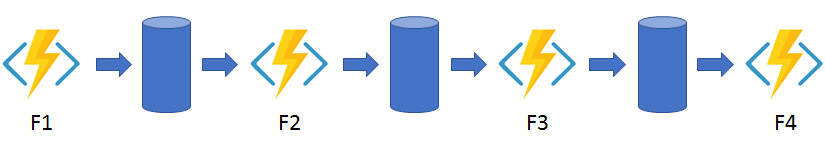

You can use Durable Functions to implement the function chaining pattern concisely as shown in the following example:

#### C#

```csharp
public static async Task<object> Run([OrchestrationTrigger] DurableOrchestrationContext context)
{
    try
    {
        var x = await context.CallActivityAsync<object>("F1");
        var y = await context.CallActivityAsync<object>("F2", x);
        var z = await context.CallActivityAsync<object>("F3", y);
        return  await context.CallActivityAsync<object>("F4", z);
    }
    catch (Exception)
    {
        // Error handling or compensation goes here.
    }
}
```

#### JavaScript (Functions 2.x only)

```javascript
const df = require("durable-functions");

module.exports = df.orchestrator(function*(context) {
    const x = yield context.df.callActivity("F1");
    const y = yield context.df.callActivity("F2", x);
    const z = yield context.df.callActivity("F3", y);
    return yield context.df.callActivity("F4", z);
});
```

In this example, the values `F1`, `F2`, `F3`, and `F4` are the names of other functions in the function app. You can implement control flow by using normal imperative coding constructs. Code executes from the top down. The code can involve existing language control flow semantics, like conditionals and loops. You can include error handling logic in `try`/`catch`/`finally` blocks.

You can use the `context` parameter [DurableOrchestrationContext] \(.NET\) and the `context.df` object (JavaScript) to invoke other functions by name, pass parameters, and return function output. Each time the code calls `await` (C#) or `yield` (JavaScript), the Durable Functions framework checkpoints the progress of the current function instance. If the process or VM recycles midway through the execution, the function instance resumes from the preceding `await` or `yield` call. For more information, see the next section, Pattern #2: Fan out/fan in.


### <a name="fan-in-out"></a>Pattern #2: Fan out/fan in

In the fan out/fan in pattern, you execute multiple functions in parallel and then wait for all functions to finish. Often, some aggregation work is done on the results that are returned from the functions.

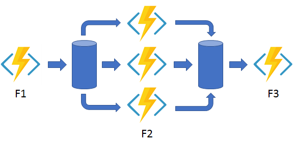

With normal functions, you can fan out by having the function send multiple messages to a queue. Fanning back in is much more challenging. To fan in, in a normal function, you write code to track when the queue-triggered functions end, and then store function outputs. 

The Durable Functions extension handles this pattern with relatively simple code:

#### Precompiled C#

```csharp
public static async Task Run([OrchestrationTrigger] DurableOrchestrationContext context)
{
    var parallelTasks = new List<Task<int>>();

    // Get a list of N work items to process in parallel.
    object[] workBatch = await context.CallActivityAsync<object[]>("F1");
    for (int i = 0; i < workBatch.Length; i++)
    {
        Task<int> task = context.CallActivityAsync<int>("F2", workBatch[i]);
        parallelTasks.Add(task);
    }

    await Task.WhenAll(parallelTasks);

    // Aggregate all N outputs and send the result to F3.
    int sum = parallelTasks.Sum(t => t.Result);
    await context.CallActivityAsync("F3", sum);
}
```

#### JavaScript (Functions 2.x only)

```javascript
const df = require("durable-functions");

module.exports = df.orchestrator(function*(context) {
    const parallelTasks = [];

    // Get a list of N work items to process in parallel.
    const workBatch = yield context.df.callActivity("F1");
    for (let i = 0; i < workBatch.length; i++) {
        parallelTasks.push(context.df.callActivity("F2", workBatch[i]));
    }

    yield context.df.Task.all(parallelTasks);

    // Aggregate all N outputs and send the result to F3.
    const sum = parallelTasks.reduce((prev, curr) => prev + curr, 0);
    yield context.df.callActivity("F3", sum);
});
```

The fan-out work is distributed to multiple instances of the `F2` function. The work is tracked by using a dynamic list of tasks. The .NET `Task.WhenAll` API or JavaScript `context.df.Task.all` API is called, to wait for all the called functions to finish. Then, the `F2` function outputs are aggregated from the dynamic task list and passed to the `F3` function.

The automatic checkpointing that happens at the `await` or `yield` call on `Task.WhenAll` or `context.df.Task.all` ensures that a potential midway crash or reboot doesn't require restarting an already completed task.

### <a name="async-http"></a>Pattern #3: Async HTTP APIs

The async HTTP APIs pattern addresses the problem of coordinating the state of long-running operations with external clients. A common way to implement this pattern is by having an HTTP call trigger the long-running action. Then, redirect the client to a status endpoint that the client polls to learn when the operation is finished.

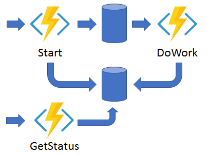

Durable Functions provides built-in APIs that simplify the code you write to interact with long-running function executions.

The following example shows REST commands that start an orchestrator and query its status. For clarity, some details are omitted from the example.

```
> curl -X POST https://myfunc.azurewebsites.net/orchestrators/DoWork -H "Content-Length: 0" -i
HTTP/1.1 202 Accepted
Content-Type: application/json
Location: https://myfunc.azurewebsites.net/admin/extensions/DurableTaskExtension/b79baf67f717453ca9e86c5da21e03ec

{"id":"b79baf67f717453ca9e86c5da21e03ec", ...}

> curl https://myfunc.azurewebsites.net/admin/extensions/DurableTaskExtension/b79baf67f717453ca9e86c5da21e03ec -i
HTTP/1.1 202 Accepted
Content-Type: application/json
Location: https://myfunc.azurewebsites.net/admin/extensions/DurableTaskExtension/b79baf67f717453ca9e86c5da21e03ec

{"runtimeStatus":"Running","lastUpdatedTime":"2017-03-16T21:20:47Z", ...}

> curl https://myfunc.azurewebsites.net/admin/extensions/DurableTaskExtension/b79baf67f717453ca9e86c5da21e03ec -i
HTTP/1.1 200 OK
Content-Length: 175
Content-Type: application/json

{"runtimeStatus":"Completed","lastUpdatedTime":"2017-03-16T21:20:57Z", ...}
```

Because the Durable Functions runtime manages state, you don't need to implement your own status-tracking mechanism.

The Durable Functions extension has built-in webhooks that manage long-running orchestrations. You can implement this pattern yourself by using your own function triggers (such as HTTP, a queue, or Azure Event Hubs) and the `orchestrationClient` binding. For example, you might use a queue message to trigger termination. Or, you might use an HTTP trigger that's protected by an Azure Active Directory authentication policy instead of the built-in webhooks that use a generated key for authentication.

Here are some examples of how to use the HTTP API pattern:

#### Precompiled C#

```csharp
// An HTTP-triggered function starts a new orchestrator function instance.
[FunctionName("StartNewOrchestration")]
public static async Task<HttpResponseMessage> Run(
    [HttpTrigger] HttpRequestMessage req,
    [OrchestrationClient] DurableOrchestrationClient starter,
    string functionName,
    ILogger log)
{
    // The function name comes from the request URL.
    // The function input comes from the request content.
    dynamic eventData = await req.Content.ReadAsAsync<object>();
    string instanceId = await starter.StartNewAsync(functionName, eventData);

    log.LogInformation($"Started orchestration with ID = '{instanceId}'.");

    return starter.CreateCheckStatusResponse(req, instanceId);
}
```

#### JavaScript (Functions 2.x only)

```javascript
// An HTTP-triggered function starts a new orchestrator function instance.
const df = require("durable-functions");

module.exports = async function (context, req) {
    const client = df.getClient(context);

    // The function name comes from the request URL.
    // The function input comes from the request content.
    const eventData = req.body;
    const instanceId = await client.startNew(req.params.functionName, undefined, eventData);

    context.log(`Started orchestration with ID = '${instanceId}'.`);

    return client.createCheckStatusResponse(req, instanceId);
};
```

In .NET, the [DurableOrchestrationClient](https://azure.github.io/azure-functions-durable-extension/api/Microsoft.Azure.WebJobs.DurableOrchestrationClient.html) `starter` parameter is a value from the `orchestrationClient` output binding, which is part of the Durable Functions extension. In JavaScript, this object is returned by calling `df.getClient(context)`. These objects provide methods you can use to start, send events to, terminate, and query for new or existing orchestrator function instances.

In the preceding examples, an HTTP-triggered function takes in a `functionName` value from the incoming URL and passes the value to [StartNewAsync](https://azure.github.io/azure-functions-durable-extension/api/Microsoft.Azure.WebJobs.DurableOrchestrationClient.html#Microsoft_Azure_WebJobs_DurableOrchestrationClient_StartNewAsync_). The [CreateCheckStatusResponse](https://azure.github.io/azure-functions-durable-extension/api/Microsoft.Azure.WebJobs.DurableOrchestrationClient.html#Microsoft_Azure_WebJobs_DurableOrchestrationClient_CreateCheckStatusResponse_System_Net_Http_HttpRequestMessage_System_String_) binding API then returns a response that contains a `Location` header and additional information about the instance. You can use the information later to look up the status of the started instance or to terminate the instance.

### <a name="monitoring"></a>Pattern #4: Monitor

The monitor pattern refers to a flexible, recurring process in a workflow. An example is polling until specific conditions are met. You can use a regular timer trigger to address a basic scenario, such as a periodic cleanup job, but its interval is static and managing instance lifetimes becomes complex. You can use Durable Functions to create flexible recurrence intervals, manage task lifetimes, and create multiple monitor processes from a single orchestration.

An example of the monitor pattern is to reverse the earlier async HTTP API scenario. Instead of exposing an endpoint for an external client to monitor a long-running operation, the long-running monitor consumes an external endpoint, and then waits for a state change.

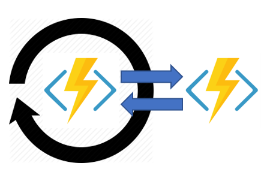

In a few lines of code, you can use Durable Functions to create multiple monitors that observe arbitrary endpoints. The monitors can end execution when a condition is met, or the `DurableOrchestrationClient` can terminate the monitors. You can change a monitor's `wait` interval based on a specific condition (for example, exponential backoff.) 

The following code implements a basic monitor:

#### Precompiled C#

```csharp
[FunctionName("Orchestrator")]
public static async Task Run([OrchestrationTrigger] DurableOrchestrationContext context)
{
    int jobId = context.GetInput<int>();
    int pollingInterval = GetPollingInterval();
    DateTime expiryTime = GetExpiryTime();

    while (context.CurrentUtcDateTime < expiryTime)
    {
        var jobStatus = await context.CallActivityAsync<string>("GetJobStatus", jobId);
        if (jobStatus == "Completed")
        {
            // Perform an action when a condition is met.
            await context.CallActivityAsync("SendAlert", machineId);
            break;
        }

        // Orchestration sleeps until this time.
        var nextCheck = context.CurrentUtcDateTime.AddSeconds(pollingInterval);
        await context.CreateTimer(nextCheck, CancellationToken.None);
    }

    // Perform more work here, or let the orchestration end.
}
```

#### JavaScript (Functions 2.x only)

```javascript
const df = require("durable-functions");
const moment = require("moment");

module.exports = df.orchestrator(function*(context) {
    const jobId = context.df.getInput();
    const pollingInternal = getPollingInterval();
    const expiryTime = getExpiryTime();

    while (moment.utc(context.df.currentUtcDateTime).isBefore(expiryTime)) {
        const jobStatus = yield context.df.callActivity("GetJobStatus", jobId);
        if (jobStatus === "Completed") {
            // Perform an action when a condition is met.
            yield context.df.callActivity("SendAlert", machineId);
            break;
        }

        // Orchestration sleeps until this time.
        const nextCheck = moment.utc(context.df.currentUtcDateTime).add(pollingInterval, 's');
        yield context.df.createTimer(nextCheck.toDate());
    }

    // Perform more work here, or let the orchestration end.
});
```

When a request is received, a new orchestration instance is created for that job ID. The instance polls a status until a condition is met and the loop is exited. A durable timer controls the polling interval. Then, more work can be performed, or the orchestration can end. When the `context.CurrentUtcDateTime` (.NET) or `context.df.currentUtcDateTime` (JavaScript) exceeds the `expiryTime` value, the monitor ends.

### <a name="human"></a>Pattern #5: Human interaction

Many automated processes involve some kind of human interaction. Involving humans in an automated process is tricky because people aren't as highly available and as responsive as cloud services. An automated process might allow for this by using timeouts and compensation logic.

An approval process is an example of a business process that involves human interaction. Approval from a manager might be required for an expense report that exceeds a certain dollar amount. If the manager doesn't approve the expense report within 72 hours (maybe the manager went on vacation), an escalation process kicks in to get the approval from someone else (perhaps the manager's manager).

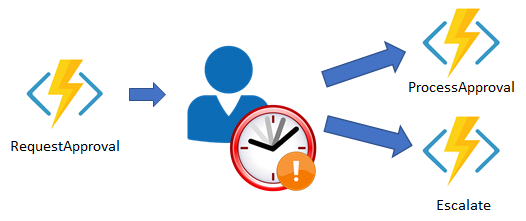

You can implement the pattern in this example by using an orchestrator function. The orchestrator uses a `durable timer` to request approval. The orchestrator escalates if timeout occurs. The orchestrator waits for an `external event`, such as a notification that's generated by a human interaction.

These examples create an approval process to demonstrate the human interaction pattern:

#### Precompiled C#

```csharp
[FunctionName("Orchestrator")]
public static async Task Run([OrchestrationTrigger] DurableOrchestrationContext context)
{
    await context.CallActivityAsync("RequestApproval");
    using (var timeoutCts = new CancellationTokenSource())
    {
        DateTime dueTime = context.CurrentUtcDateTime.AddHours(72);
        Task durableTimeout = context.CreateTimer(dueTime, timeoutCts.Token);

        Task<bool> approvalEvent = context.WaitForExternalEvent<bool>("ApprovalEvent");
        if (approvalEvent == await Task.WhenAny(approvalEvent, durableTimeout))
        {
            timeoutCts.Cancel();
            await context.CallActivityAsync("ProcessApproval", approvalEvent.Result);
        }
        else
        {
            await context.CallActivityAsync("Escalate");
        }
    }
}
```

#### JavaScript (Functions 2.x only)

```javascript
const df = require("durable-functions");
const moment = require('moment');

module.exports = df.orchestrator(function*(context) {
    yield context.df.callActivity("RequestApproval");

    const dueTime = moment.utc(context.df.currentUtcDateTime).add(72, 'h');
    const durableTimeout = context.df.createTimer(dueTime.toDate());

    const approvalEvent = context.df.waitForExternalEvent("ApprovalEvent");
    if (approvalEvent === yield context.df.Task.any([approvalEvent, durableTimeout])) {
        durableTimeout.cancel();
        yield context.df.callActivity("ProcessApproval", approvalEvent.result);
    } else {
        yield context.df.callActivity("Escalate");
    }
});
```

To create the durable timer, call `context.CreateTimer` (.NET) or `context.df.createTimer` (JavaScript). The notification is received by `context.WaitForExternalEvent` (.NET) or `context.df.waitForExternalEvent` (JavaScript). Then, `Task.WhenAny` (.NET) or `context.df.Task.any` (JavaScript) is called to decide whether to escalate (timeout happens first) or process the approval (the approval is received before timeout).

An external client can deliver the event notification to a waiting orchestrator function by using either the built-in HTTP APIs or by using the [DurableOrchestrationClient.RaiseEventAsync](https://azure.github.io/azure-functions-durable-extension/api/Microsoft.Azure.WebJobs.DurableOrchestrationClient.html#Microsoft_Azure_WebJobs_DurableOrchestrationClient_RaiseEventAsync_System_String_System_String_System_Object_) API from another function:

#### Precompiled C#

```csharp
public static async Task Run(
  [HttpTrigger] string instanceId,
  [OrchestrationClient] DurableOrchestrationClient client)
{
    bool isApproved = true;
    await client.RaiseEventAsync(instanceId, "ApprovalEvent", isApproved);
}
```

#### Javascript

```javascript
const df = require("durable-functions");

module.exports = async function (context) {
    const client = df.getClient(context);
    const isApproved = true;
    await client.raiseEvent(instanceId, "ApprovalEvent", isApproved);
};
```

### <a name="aggregator"></a>Pattern #6: Aggregator (preview)

The sixth pattern is about aggregating event data over a period of time into a single, addressable *entity*. In this pattern, the data being aggregated may come from multiple sources, may be delivered in batches, or may be scattered over long-periods of time. The aggregator might need to take action on event data as it arrives, and external clients may need to query the aggregated data.

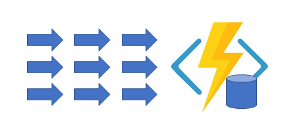

The tricky thing about trying to implement this pattern with normal, stateless functions is that concurrency control becomes a huge challenge. Not only do you need to worry about multiple threads modifying the same data at the same time, you also need to worry about ensuring that the aggregator only runs on a single VM at a time.

Using a Durable Entity function, one can implement this pattern easily as a single function.

```csharp
[FunctionName("Counter")]
public static void Counter([EntityTrigger] IDurableEntityContext ctx)
{
    int currentValue = ctx.GetState<int>();

    switch (ctx.OperationName.ToLowerInvariant())
    {
        case "add":
            int amount = ctx.GetInput<int>();
            currentValue += operand;
            break;
        case "reset":
            currentValue = 0;
            break;
        case "get":
            ctx.Return(currentValue);
            break;
    }

    ctx.SetState(currentValue);
}
```

Durable Entities can also be modeled as .NET classes. This can be useful if the list of operations becomes large and if it is mostly static. The following example is an equivalent implementation of the `Counter` entity using .NET classes and methods.

```csharp
public class Counter
{
    [JsonProperty("value")]
    public int CurrentValue { get; set; }

    public void Add(int amount) => this.CurrentValue += amount;
    
    public void Reset() => this.CurrentValue = 0;
    
    public int Get() => this.CurrentValue;

    [FunctionName(nameof(Counter))]
    public static Task Run([EntityTrigger] IDurableEntityContext ctx)
        => ctx.DispatchAsync<Counter>();
}
```

Clients can enqueue *operations* for (also known as "signaling") an entity function using the `orchestrationClient` binding.

```csharp
[FunctionName("EventHubTriggerCSharp")]
public static async Task Run(
    [EventHubTrigger("device-sensor-events")] EventData eventData,
    [OrchestrationClient] IDurableOrchestrationClient entityClient)
{
    var metricType = (string)eventData.Properties["metric"];
    var delta = BitConverter.ToInt32(eventData.Body, eventData.Body.Offset);

    // The "Counter/{metricType}" entity is created on-demand.
    var entityId = new EntityId("Counter", metricType);
    await entityClient.SignalEntityAsync(entityId, "add", delta);
}
```

Dynamically generated proxies are also available for signaling entities in a type-safe way. And in addition to signaling, clients can also query for the state of an entity function using methods on the `orchestrationClient` binding.

> [!NOTE]
> Entity functions are currently in preview.

# The technology in detail

Behind the scenes, the Durable Functions extension is built on top of the [Durable Task Framework](https://github.com/Azure/durabletask), an open-source library on GitHub that's used to build durable task orchestrations. Like Azure Functions is the serverless evolution of Azure WebJobs, Durable Functions is the serverless evolution of the Durable Task Framework. Microsoft and other organizations use the Durable Task Framework extensively to automate mission-critical processes. It's a natural fit for the serverless Azure Functions environment.

## Desing pattern, checkpointing, and replay

Orchestrator functions reliably maintain their execution state by using the `...` design pattern. Instead of directly storing the current state of an orchestration, the Durable Functions extension **uses an append-only store to record the full series of actions** the function orchestration takes. An append-only store has many benefits compared to "dumping" the full runtime state. Benefits include increased performance, scalability, and responsiveness. 

Durable Functions uses this `...` pattern transparently. Behind the scenes: 
1. The `await` (C#) or `yield` (JavaScript) operator in an orchestrator function yields control of the orchestrator thread back to the Durable Task Framework dispatcher
2. The dispatcher then commits any new actions that the orchestrator function scheduled (such as calling one or more child functions or scheduling a durable timer) to storage
3. The transparent commit action appends to the execution history of the orchestration instance. The history is stored in a storage table. 
4. The commit action then adds messages to a queue to schedule the actual work. At this point, the orchestrator function can be unloaded from memory. 

Billing for the orchestrator function stops if you're using the Azure Functions consumption plan. When there's more work to do, the function restarts, and its state is reconstructed.

When an orchestration function is given more work to do (for example, a response message is received or a durable timer expires), the **orchestrator wakes up and re-executes the entire function from the start to rebuild the local state**. 


## Storage and scalability

The Durable Functions extension uses queues, tables, and blobs in Azure Storage to persist execution history state and trigger function execution. You can use the default storage account for the function app, or you can configure a separate storage account. You might want a separate account based on storage throughput limits. The orchestrator code you write doesn't interact with the entities in these storage accounts. The Durable Task Framework manages the entities directly as an implementation detail.

Orchestrator functions schedule activity functions and receive their responses via internal queue messages. When a function app runs in the Azure Functions consumption plan, the Azure Functions scale controller monitors these queues. New compute instances are added as needed. When scaled out to multiple VMs, an orchestrator function might run on one VM, while activity functions that the orchestrator function calls might run on several different VMs.

The **execution history** for orchestrator accounts is **stored in table storage**. Whenever an instance rehydrates on a particular VM, the orchestrator fetches its execution history from table storage so it can rebuild its local state. A convenient aspect of having the history available in table storage is that you can use tools like Azure Storage Explorer to see the history of your orchestrations.

Storage blobs are primarily **used as a leasing mechanism** to coordinate the scale-out of orchestration instances across multiple VMs. Storage blobs hold data for large messages that can't be stored directly in tables or queues.

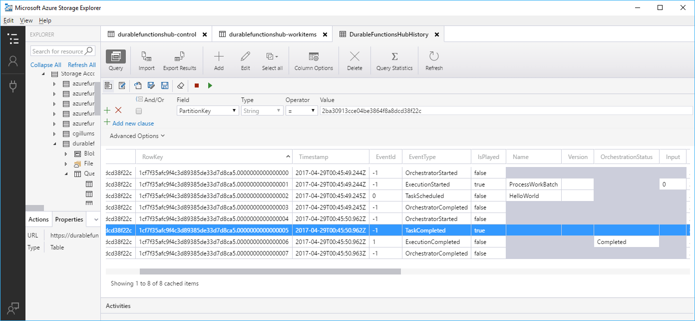


# Runtime scaling

Azure Functions uses a component called the *scale controller* to monitor the rate of events and determine whether to scale out or scale in. The scale controller uses heuristics for each trigger type. For example, when you're using an Azure Queue storage trigger, it scales based on the queue length and the age of the oldest queue message.

The unit of scale for Azure Functions is the function app. When the function app is scaled out, additional resources are allocated to run multiple instances of the Azure Functions host. Conversely, as compute demand is reduced, the scale controller removes function host instances. The number of instances is eventually scaled down to zero when no functions are running within a function app.

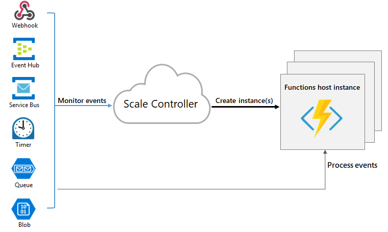

### Understanding scaling behaviors

Scaling can vary on a number of factors, and scale differently based on the trigger and language selected. There are a few intricacies of scaling behaviors to be aware of:

* A single function app only scales up to a maximum of 200 instances. A single instance may process more than one message or request at a time though, so there isn't a set limit on number of concurrent executions.
* For HTTP triggers, new instances will only be allocated at most once every 1 second.
* For non-HTTP triggers, new instances will only be allocated at most once every 30 seconds.

Different triggers may also have different scaling limits as well as documented below:


# Versioning in Durable Functions

It is inevitable that functions will be added, removed, and changed over the lifetime of an application. Durable Functions allows chaining functions together in ways that weren't previously possible, and this chaining affects how you can handle versioning.

## How to handle breaking changes

There are several examples of breaking changes to be aware of. This article discusses the most common ones. The main theme behind all of them is that both new and existing function orchestrations are impacted by changes to function code.

### Changing activity function signatures

A signature change refers to a change in the name, input, or output of a function. If this kind of change is made to an activity function, it could break the orchestrator function that depends on it. If you update the orchestrator function to accommodate this change, you could break existing in-flight instances.

As an example, suppose we have the following function.

```csharp
[FunctionName("FooBar")]
public static Task Run([OrchestrationTrigger] DurableOrchestrationContext context)
{
    bool result = await context.CallActivityAsync<bool>("Foo");
    await context.CallActivityAsync("Bar", result);
}
```

This simplistic function takes the results of **Foo** and passes it to **Bar**. Let's assume we need to change the return value of **Foo** from `bool` to `int` to support a wider variety of result values. The result looks like this:

```csharp
[FunctionName("FooBar")]
public static Task Run([OrchestrationTrigger] DurableOrchestrationContext context)
{
    int result = await context.CallActivityAsync<int>("Foo");
    await context.CallActivityAsync("Bar", result);
}
```

This change works fine for all new instances of the orchestrator function but breaks any in-flight instances. For example, consider the case where an orchestration instance calls **Foo**, gets back a boolean value and then checkpoints. If the signature change is deployed at this point, the checkpointed instance will fail immediately when it resumes and replays the call to `context.CallActivityAsync<int>("Foo")`. This is because the result in the history table is `bool` but the new code tries to deserialize it into `int`.

This is just one of many different ways that a signature change can break existing instances. In general, if an orchestrator needs to change the way it calls a function, then the change is likely to be problematic.

### Changing orchestrator logic

The other class of versioning problems come from changing the orchestrator function code in a way that confuses the replay logic for in-flight instances.

Consider the following orchestrator function:

```csharp
[FunctionName("FooBar")]
public static Task Run([OrchestrationTrigger] DurableOrchestrationContext context)
{
    bool result = await context.CallActivityAsync<bool>("Foo");
    await context.CallActivityAsync("Bar", result);
}
```

Now let's assume you want to make a seemingly innocent change to add another function call.

```csharp
[FunctionName("FooBar")]
public static Task Run([OrchestrationTrigger] DurableOrchestrationContext context)
{
    bool result = await context.CallActivityAsync<bool>("Foo");
    if (result)
    {
        await context.CallActivityAsync("SendNotification");
    }

    await context.CallActivityAsync("Bar", result);
}
```

This change adds a new function call to **SendNotification** between **Foo** and **Bar**. There are no signature changes. The problem arises when an existing instance resumes from the call to **Bar**. During replay, if the original call to **Foo** returned `true`, then the orchestrator replay will call into **SendNotification** which is not in its execution history. As a result, the Durable Task Framework fails with a `NonDeterministicOrchestrationException` because it encountered a call to **SendNotification** when it expected to see a call to **Bar**.

## Mitigation strategies

Here are some of the strategies for dealing with versioning challenges:

* Do nothing
* Stop all in-flight instances
* Side-by-side deployments

### Do nothing

The easiest way to handle a breaking change is to let in-flight orchestration instances fail. New instances successfully run the changed code.

Whether this is a problem depends on the importance of your in-flight instances. If you are in active development and don't care about in-flight instances, this might be good enough. However, you will need to deal with exceptions and errors in your diagnostics pipeline. If you want to avoid those things, consider the other versioning options.

### Stop all in-flight instances

Another option is to stop all in-flight instances. This can be done by clearing the contents of the internal **control-queue** and **workitem-queue** queues. The instances will be forever stuck where they are, but they will not clutter your telemetry with failure messages. This is ideal in rapid prototype development.

> [!WARNING]
> The details of these queues may change over time, so don't rely on this technique for production workloads.

### Side-by-side deployments

The most fail-proof way to ensure that breaking changes are deployed safely is by deploying them side-by-side with your older versions. This can be done using any of the following techniques:

* Deploy all the updates as entirely new functions (new names).
* Deploy all the updates as a new function app with a different storage account.
* Deploy a new copy of the function app but with an updated `TaskHub` name. This is the recommended technique.

### How to change task hub name

The task hub can be configured in the *host.json* file as follows:

#### Functions 1.x

```json
{
    "durableTask": {
        "HubName": "MyTaskHubV2"
    }
}
```

#### Functions 2.x

The default value is `DurableFunctionsHub`.

All Azure Storage entities are named based on the `HubName` configuration value. By giving the task hub a new name, you ensure that separate queues and history table are created for the new version of your application.

We recommend that you deploy the new version of the function app to a new [Deployment Slot](https://blogs.msdn.microsoft.com/appserviceteam/2017/06/13/deployment-slots-preview-for-azure-functions/). Deployment slots allow you to run multiple copies of your function app side-by-side with only one of them as the active *production* slot. When you are ready to expose the new orchestration logic to your existing infrastructure, it can be as simple as swapping the new version into the production slot.

> [!NOTE]
> This strategy works best when you use HTTP and webhook triggers for orchestrator functions. For non-HTTP triggers, such as queues or Event Hubs, the trigger definition should [derive from an app setting](../functions-bindings-expressions-patterns.md#binding-expressions---app-settings) that gets updated as part of the swap operation.


# Task hubs in Durable Functions

A *task hub* in Durable Functions is a logical container for Azure Storage resources that are used for orchestrations. Orchestrator and activity functions can only interact with each other when they belong to the same task hub.

If multiple function apps share a storage account, each function app *must* be configured with a separate task hub name. A storage account can contain multiple task hubs. The following diagram illustrates one task hub per function app in shared and dedicated storage accounts.

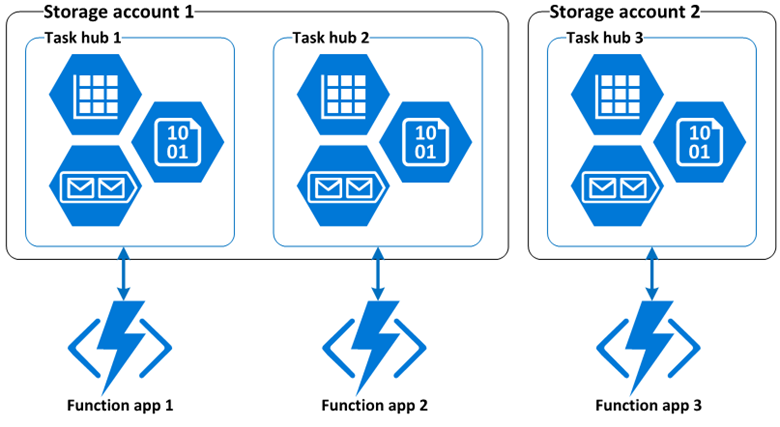

## Azure Storage resources

A task hub consists of the following storage resources:

* One or more control queues.
* One work-item queue.
* One history table.
* One instances table.
* One storage container containing one or more lease blobs.

All of these resources are created automatically in the default Azure Storage account when orchestrator or activity functions run or are scheduled to run.

## Task hub names

Task hubs are identified by a name that is declared in the *host.json* file, as shown in the following example:

### host.json (Functions 2.x)

```json
{
  "version": "2.0",
  "extensions": {
    "durableTask": {
      "hubName": "MyTaskHub"
    }
  }
}
```

Task hubs can also be configured using app settings, as shown in the following *host.json* example file:

### host.json (Functions 2.x)

```json
{
  "version": "2.0",
  "extensions": {
    "durableTask": {
      "hubName": "%MyTaskHub%"
    }
  }
}
```

The task hub name will be set to the value of the `MyTaskHub` app setting. The following `local.settings.json` demonstrates how to define the `MyTaskHub` setting as `samplehubname`:

```json
{
  "IsEncrypted": false,
  "Values": {
    "MyTaskHub" : "samplehubname"
  }
}
```

Task hub names must start with a letter and consist of only letters and numbers. If not specified, the default name is **DurableFunctionsHub**.

> [!NOTE]
> The name is what differentiates one task hub from another when there are multiple task hubs in a shared storage account. If you have multiple function apps sharing a shared storage account, you must explicitly configure different names for each task hub in the *host.json* files. Otherwise the multiple function apps will compete with each other for messages, which could result in undefined behavior.


# Create Durable Functions using the Azure portal

The Durable Functions extension for Azure Functions is provided in the NuGet package [Microsoft.Azure.WebJobs.Extensions.DurableTask](https://www.nuget.org/packages/Microsoft.Azure.WebJobs.Extensions.DurableTask). This extension must be installed in your function app. This article shows how to install this package so that you can develop durable functions in the Azure portal.


## Create a function app

You must have a function app to host the execution of any function. A function app lets you group your functions as a logic unit for easier management, deployment, and sharing of resources. You can create a .NET or JavaScript app.

By default, the function app created uses version 2.x of the Azure Functions runtime. The Durable Functions extension works on both versions 1.x and 2.x of the Azure Functions runtime in C#, and version 2.x in JavaScript. However, templates are only available when targeting version 2.x of the runtime regardless of the chosen language.

## Install the durable-functions npm package (JavaScript only)

If you are creating JavaScript Durable Functions, you will need to install the [`durable-functions` npm package](https://www.npmjs.com/package/durable-functions).

1. Select your function app's name, followed by **Platform Features**, then **Advanced tools (Kudu)**.

   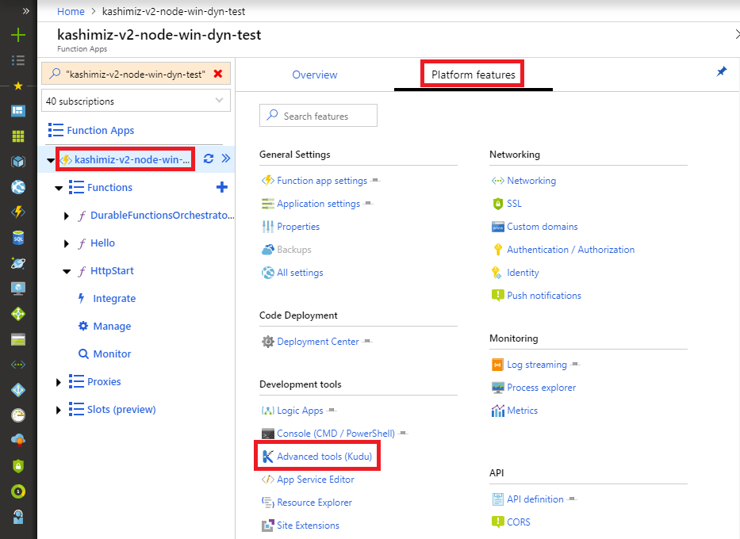

2. Inside the Kudu console, select **Debug console** then **CMD**.

   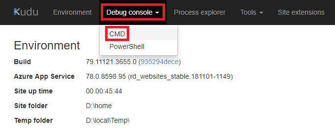

3. Your function app's file directory structure should display. Navigate to the `site/wwwroot` folder. From there, you can upload a `package.json` file by dragging and dropping it into the file directory window. A sample `package.json` is below:

    ```json
    {
      "dependencies": {
        "durable-functions": "^1.1.2"
      }
    }
    ```

   

4. Once your `package.json` is uploaded, run the `npm install` command from the Kudu Remote Execution Console.

   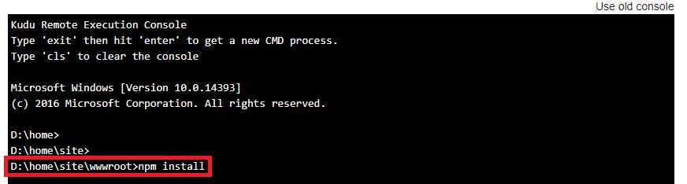

## Create an orchestrator function

1. Expand your function app and click the **+** button next to **Functions**. If this is the first function in your function app, select **In-portal** then **Continue**. Otherwise, go to step three.

   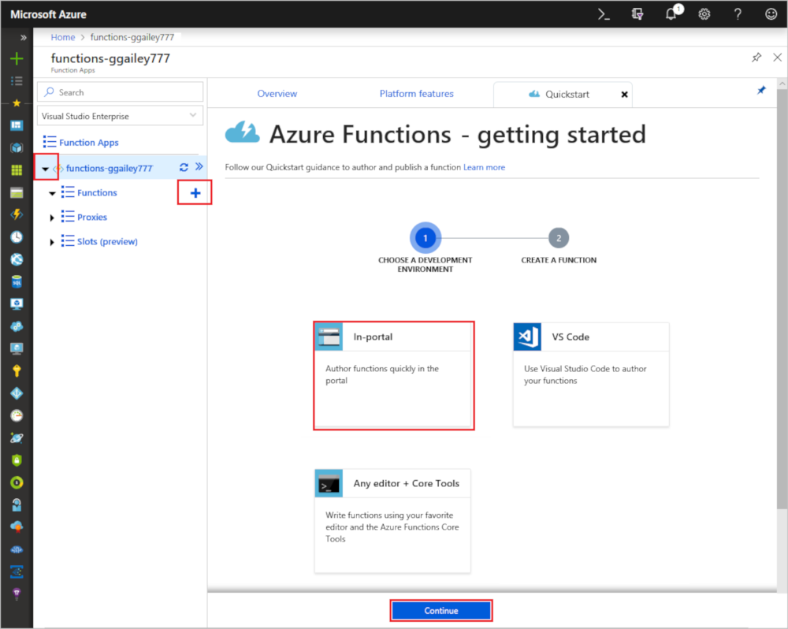

1. Choose **More templates** then **Finish and view templates**.

    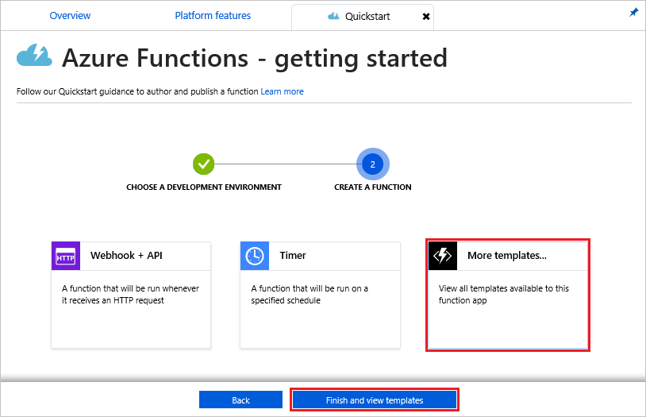

1. In the search field, type `durable` and then choose the  **Durable Functions HTTP starter** template.

1. When prompted, select **Install** to install the Azure DurableTask extension any dependencies in the function app. You only need to install the extension once for a give function app. After installation succeeds, select **Continue**.

    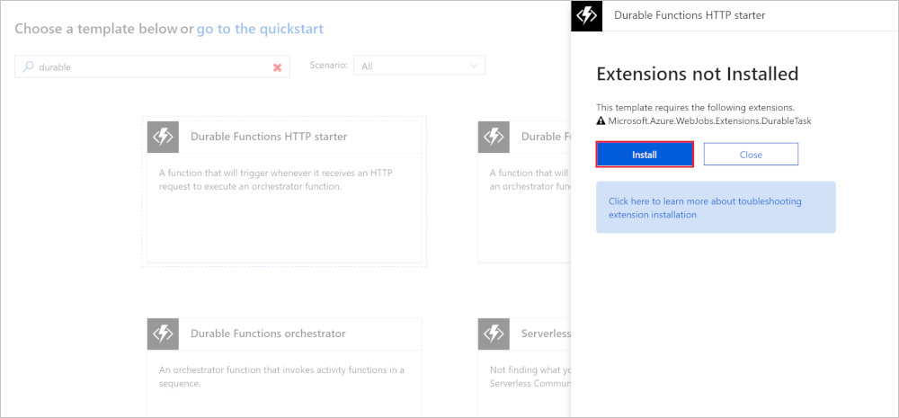

1. After the installation completes, name the new function `DurableFunctionsHttpStartTEST` and choose **Create**. The function created is used to start the orchestration.

1. Create another function in the function app, this time by using the **Durable Functions Orchestrator** template. Name your new orchestration function `DurableFunctionsOrchestratorJSTEST`.

1. Create a third function named `HelloTEST` by using the **Durable Functions Activity** template.

## Test the durable function orchestration

1. Go back to the **HttpStart** function, choose **</> Get function URL** and **Copy** the URL. You use this URL to start the **HelloSequence** function.

1. Use an HTTP tool like Postman or cURL to send a POST request to the URL that you copied. The following example is a cURL command that sends a POST request to the durable function:

    ```bash
    curl -X POST https://{your-function-app-name}.azurewebsites.net/api/orchestrators/DurableFunctionsOrchestratorJSTEST
    ```

    In this example, `{your-function-app-name}` is the domain that is the name of your function app. The response message contains a set of URI endpoints that you can use to monitor and manage the execution, which looks like the following example:

    ```json
    {  
       "id":"10585834a930427195479de25e0b952d",
       "statusQueryGetUri":"https://...",
       "sendEventPostUri":"https://...",
       "terminatePostUri":"https://...",
       "rewindPostUri":"https://..."
    }
    ```

1. Call the `statusQueryGetUri` endpoint URI and you see the current status of the durable function, which might look like this example:

    ```json
        {
            "runtimeStatus": "Running",
            "input": null,
            "output": null,
            "createdTime": "2017-12-01T05:37:33Z",
            "lastUpdatedTime": "2017-12-01T05:37:36Z"
        }
    ```

1. Continue calling the `statusQueryGetUri` endpoint until the status changes to **Completed**, and you see a response like the following example:

    ```json
    {
            "runtimeStatus": "Completed",
            "input": null,
            "output": [
                "Hello Tokyo!",
                "Hello Seattle!",
                "Hello London!"
            ],
            "createdTime": "2017-12-01T05:38:22Z",
            "lastUpdatedTime": "2017-12-01T05:38:28Z"
        }
    ```

Your first durable function is now up and running in Azure.

